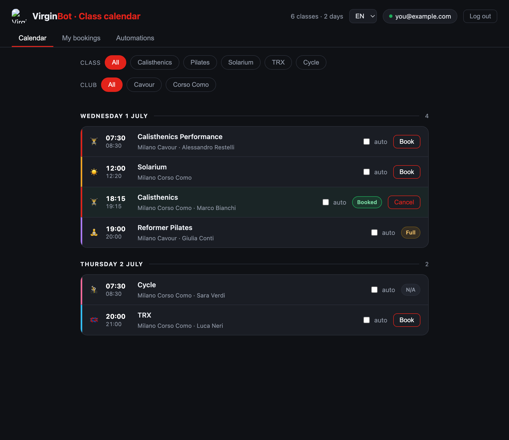
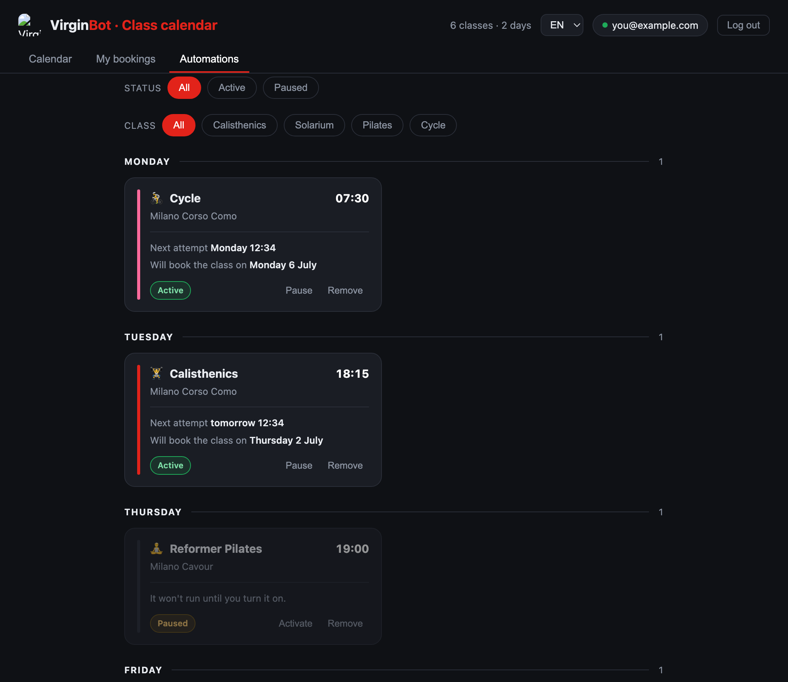

<div align="center">

# 🏋️ VirginBot

**Auto-books your Virgin Active Italia gym classes the instant the booking window opens — and emails you the result.**

Pure Go · single static binary · no CGO · embedded web UI · it/es/en

</div>

---

## What is this?

Popular classes at my gym (Calisthenics, Solarium) fill up the moment their booking window opens — often 8 days in advance, at the exact class time, while I'm asleep or at work. **VirginBot books them for me automatically.**

You pick the weekly classes you care about, and the bot wakes up at precisely the right instant, grabs your spot the second it's available, and sends you an email with the outcome. It's a small, self-hosted web app you log into with your own Virgin Active account.

> It started life scraping the Virgin Active **website** and ended up speaking the same **private mobile API** the official app uses. That journey is the fun part — see the callout below. 👇

<div align="center">

### 🔍 Curious how it works under the hood?

**[Read the reverse-engineering story →](docs/reverse-engineering.md)**

*MITM'ing my own phone, finding the app's hidden JSON API, and the architecture behind the precise-timing engine.*

</div>

---

## Screenshots

| Calendar | Automations |
|---|---|
|  |  |

*Live class calendar with one-click booking · weekly automations grouped by day, each pausable without losing its setup.*

---

## Features

- 📅 **Live calendar** of the classes you care about (per logged-in user), one-click booking and cancellation.
- 🤖 **Automations** — mark a weekly class as *auto* and the bot books it **precisely when the window opens** (8 days before — 2 for the Solarium — at the exact class time), retrying a few times in case the slot is enabled a few seconds late. Recurring every week; pause and resume any rule.
- 📖 **"My bookings"** synced from the real source of truth (your bookings match your phone).
- ✉️ **Email notifications** — automation added/removed, booking succeeded/failed.
- 🌍 **Multilingual** — UI and emails in **Italian, Spanish and English**, auto-detected from the browser with a manual switcher.
- 🔐 **Multi-user** with an email allowlist, encrypted credentials at rest, and login rate-limiting.

---

## Motivation

Two goals. The first is to build a real, working application that delivers genuine value to the people using it — myself included, since I rely on it to book my own classes. The second is personal: getting hands-on experience with Go, a language I don't use professionally but would like to work with one day.

---

## Run it locally

Requirements: **Go 1.26+**.

1. Create a `.env` (git-ignored):
   ```dotenv
   APP_SECRET=<openssl rand -hex 32>          # encrypts users' passwords — required
   VA_API_KEY=<static x-api-key from the app> # required
   VA_ALLOWED_EMAILS=you@example.com          # allowlist (empty = open registration)
   VA_ADMIN_EMAIL=you@example.com             # optional: unlocks the admin tab (view/manage every user's automations)
   # SMTP (optional, for email notifications)
   SMTP_HOST=...  SMTP_PORT=587  SMTP_USER=...  SMTP_PASS=...  SMTP_FROM=<verified sender>
   # Optional: seed the first user without the login screen
   VA_EMAIL=...  VA_PASS=...
   ```
2. Run:
   ```bash
   ./run.sh           # builds, runs, opens the browser, tees logs to ./logs/
   # or simply:
   go run .
   ```
3. Open `http://localhost:8080` and log in with your Virgin Active account.

Engine timing is tunable without recompiling: `VIRGINBOT_ATTEMPTS`, `VIRGINBOT_GAP_SEC`, `VIRGINBOT_LEAD_SEC`. `VIRGINBOT_DEBUG=1` logs every engine evaluation.

---

## Deploy (Fly.io)

A `Dockerfile` (multi-stage, distroless, static binary with embedded tzdata) and `fly.toml` (single always-on machine + a persistent volume for the SQLite DB) are included.

```bash
fly apps create <name>
fly volumes create virginbot_data --region fra --size 1 -a <name>
fly secrets set -a <name> APP_SECRET=... VA_API_KEY=... VA_ALLOWED_EMAILS=... SMTP_*=...
fly deploy -a <name>
```

The engine must run 24/7 (it can't "scale to zero"), so expect a small always-on cost. A spare always-on machine at home (Windows/WSL or any Linux box) behind a Cloudflare Tunnel is a free alternative.

---

## Security

- Virgin passwords are stored **encrypted** (AES-256-GCM); `APP_SECRET` is mandatory (no insecure default).
- Login is **rate-limited** per IP; registration is gated by an **email allowlist**.
- `VA_API_KEY` is an app-level static key (anyone can extract it from the app); it lives in secrets, not in the repo.
- Session cookies are `HttpOnly` + `Secure` (under HTTPS) + `SameSite=Lax`, with a 30-day TTL.
- No secrets are committed; `.env`, the SQLite DB and capture files are git-ignored.

---

## Architecture at a glance

Pure Go, single binary, SQLite (`modernc.org/sqlite`, no CGO), web UI embedded via `go:embed`. The automation engine sleeps until the next trigger and only then touches the network — no continuous polling.

**[Full architecture & the reverse-engineering story →](docs/reverse-engineering.md)**
